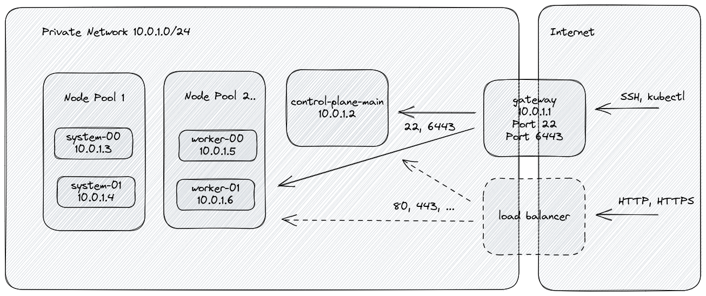

# Kubernetes Terraform installer for Hetzner Cloud

This Terraform module creates a Kubernetes Cluster on
[Hetzner Cloud](https://console.hetzner.cloud/) infrastructure running Ubuntu
22.04. The module aims to be simple to use while providing an out-of-the-box
secure and maintainable setup. Thanks to Ubuntu's LTS version we get up to 5
years of peace and quiet before having to upgrade the cluster's operating
system!



## Features

- [k3s](https://k3s.io/) based kubernetes cluster.
- Secured default configuration:
  - Cluster nodes have no public network interface.
  - SSH key required for remote access.
  - `fail2ban` limits SSH brute force attacks.
  - Internal firewall on all nodes with minimal exposure.
  - Cluster is not exposed to incoming traffic from the internet after the
    initiral setup. The cluster administrator starts exposing the cluster by
    deploying a load balancer, e.g. by annotating an installed ingress
    controller.
- Calculation of monthly costs for every part of the deployment (see
  `terraform output`).
- Node pools for managing cluster resources efficiently. Minimum cluster size is
  _one_ main node. Pools can be added, resized, and removed at any time.
- Automatic operating system updates with optional automatic reboots via
  [kured](https://kured.dev).
- Support for network policies via [Cilium](https://www.cilium.io/).
- Hetzner Cloud Controller Manager for managing cloud resources from the within
  the cluster.
- Hetzner Cloud Storage Interface for managing volumes from the within the
  cluster.
- Convenience scripts for downloading the kubernetes configuration and accessing
  nodes via SSH/SCP.
- Documentation of common administrative tasks and debugging tools.

TODO:

- Kubernetes update managment.

## Install

### Prerequisites

- [Terraform](https://terraform.io) or [OpenTofu](https://opentofu.org/)
- Bash
- SSH with an SSH Key and Agent
- `kubectl`
- `jq` installed is recommended

Note that you'll need Terraform v1.0 or newer to run this project.

### Hetzner Cloud API Token

Before running the project you'll have to create an access token for Terraform
to connect to the Hetzner Cloud API. Connect to the
[Hetzner cloud](https://console.hetzner.cloud), navigate to your project, select
security settings - API tokens and create a new token.

```bash
read -sp "Hetzner Cloud API Token: " TF_VAR_hcloud_token # Enter your Hetzner Cloud API Token (it will be hidden)
export TF_VAR_hcloud_token
export HCLOUD_TOKEN=${TF_VAR_hcloud_token}
```

## Usage

### Initialization

Make a copy of the [`examples/`](./examples) directory on your local file
system.

- Run `terraform init`
- Modify the `cluster` section in [`main.tf`](./examples/main.tf) to your
  liking, e.g. `cluster_name`, `k3s_version`, `ssh_keys`,
  `control_plane_main_server_type` and `node_pools`.

That's all it takes to get started!

Pin to a specific module version using `version = "..."` to avoid upgrading to a
version with breaking changes. Upgrades to this module could potentially replace
all control plane and worker nodes resulting in data loss. The `terraform plan`
will report this, but it may not be obvious.

### Creation

Create an Hetzner Cloud Kubernetes cluster with one control plane and a worker
node:

```bash
terraform apply
```

This will do the following:

- Provisions Hetzner Cloud Instances with Ubuntu (the instance type/size of the
  control plane and worker node pools may be different).
- Installs K3S components and supporting binaries.
- Joins the nodes in the cluster.
  - Installs Hetzner Cloud add-ons:
    - [CSI](https://github.com/hetznercloud/csi-driver) (Container Storage
      Interface driver for Hetzner Cloud Volumes)
    - [CCM](https://github.com/hetznercloud/hcloud-cloud-controller-manager)
      (Kubernetes cloud-controller-manager for Hetzner Cloud)
- Creates two bash scripts `setkubeconfig` and `unsetkubeconfig` to
  setup/destroy new context in the kubectl admin config file.
- Creates `ssh-node`, `scp-node`, and `ls-nodes` bash script and an ssh
  configuration to quickly connect to all servers.

### Maintenance

#### Add Load Balancer

TODO

#### Add Nodes or Node Pools

The number of nodes in a node pool can be increased at any point. Just increase
the count and apply the new configuration via `terraform apply`. After a few
minutes the additional nodes will appear in the cluster.

In the same way, node pools cann be added to the configuration without any
precaution.

#### Remove Nodes or Node Pools

Removing a nodes requires the following steps:

1. Identify the nodes and node pools that shall be removed. If the number of
   nodes in a node pool needs to be decreased, the nodes will be removed from
   the highest to the lowest number. Example: when the number of nodes in pool
   `system` is decreased from `3` to `2`, node `cluster-system-02` will be
   removed and nodes `cluster-system-01` and `cluster-system-00` will remain.
2. Drain all nodes that will be removed of pods:
   `kubectl drain cluster-system-02`
3. Wait until all pods have been migrated to other nodes before continuing.
   - If the wrong node was drained, reactivate the node:
     `kubectl uncordon cluster-system-02`
4. Update the terrafrom configuration and apply it: `terraform apply`
   - Review the plan to verify that the drained nodes will be deleted.
5. Delete nodes from cluster: `kubectl delete node cluster-system-02`

#### Stop Automated Node Reboots

Nodes are rebooting automatically when they receive updates that require a
reboot. The kured service triggers the reboots of nodes one by one. Reboots can
be disabled system wide by annotating the Daemonset, see
https://kured.dev/docs/operation/.

#### Upgrade Operating System

TODO

#### Update Kubernetes

TODO

#### Update Cilium

See https://docs.cilium.io/en/stable/operations/upgrade/

#### Update Hetzner CCM

See
https://github.com/hetznercloud/hcloud-cloud-controller-manager/blob/main/CHANGELOG.md

#### Update Hetzner CSI

See https://github.com/hetznercloud/csi-driver/blob/main/CHANGELOG.md

### Deletion

After applying the Terraform plan you'll see several output variables like the
load balancer's, control plane's, and node pools' IP addresses.

```bash
terraform destroy -force
```

Be sure to clean-up any CSI created Block Storage Volumes, and CCM created
NodeBalancers that you no longer require.

## Addons Included

### [**Hetzner Cloud cloud controller manager (CCM)**](https://github.com/hetznercloud/hcloud-cloud-controller-manager)

The Hetzner Cloud cloud controller manager integrates your Kubernets cluster
with the Hetzner Cloud API. Read more about kubernetes cloud controller managers
in the
[kubernetes documentation](https://kubernetes.io/docs/tasks/administer-cluster/running-cloud-controller/).

#### Features

- **instances interface**: adds the server type to the
  `beta.kubernetes.io/instance-type` label, sets the external IPv4 and IPv6
  addresses and deletes nodes from Kubernetes that were deleted from the Hetzner
  Cloud.
- **zones interface**: makes Kubernetes aware of the failure domain of the
  server by setting the `failure-domain.beta.kubernetes.io/region` and
  `failure-domain.beta.kubernetes.io/zone` labels on the node.
- **Private Networks**: allows to use Hetzner Cloud Private Networks for your
  pods traffic.
- **Load Balancers**: allows to use Hetzner Cloud Load Balancers with Kubernetes
  Services

### [**Container Storage Interface driver for Hetzner Cloud (CSI)**](https://github.com/hetznercloud/csi-driver)

This is a Container Storage Interface driver for Hetzner Cloud enabling you to
use Volumes within Kubernetes.

When a `PV` is deleted, the Hetzner Block Storage Volume will be deleted as
well, based on the `ReclaimPolicy`.

[Learn More about Persistent Volumes on kubernetes.io](https://kubernetes.io/docs/concepts/storage/persistent-volumes/).

## Debugging

### Gateway

Ensure gateway is set up correctly: `./ssh-node gateway`

#### Verify packet masquarading is set up properly

```bash
iptables -L -t nat

# Expected output:
# Chain PREROUTING (policy ACCEPT)
# target     prot opt source               destination
#
# Chain INPUT (policy ACCEPT)
# target     prot opt source               destination
#
# Chain OUTPUT (policy ACCEPT)
# target     prot opt source               destination
#
# Chain POSTROUTING (policy ACCEPT)
# target     prot opt source               destination
# MASQUERADE  all  --  10.0.1.0/24          anywhere
```

#### Verify firewall is set up properly

```bash
ufw status

# Expected output:
# Status: active
#
# To                         Action      From
# --                         ------      ----
# 22,6443/tcp                ALLOW       Anywhere
# 22,6443/tcp (v6)           ALLOW       Anywhere (v6)
#
# Anywhere on eth0           ALLOW FWD   Anywhere on ens10
# Anywhere (v6) on eth0      ALLOW FWD   Anywhere (v6) on ens10
```

### Cluster

Ensure cluster is set up correctly: `./ssh-node cluster`

#### Verify default route is configured properly

```bash
ip r s

# Expected output:
# default via 10.0.0.1 dev ens10 proto static onlink <-- this is the important line
# 10.0.0.0/8 via 10.0.0.1 dev ens10 proto dhcp src 10.0.1.2 metric 1024
# 10.0.0.1 dev ens10 proto dhcp scope link src 10.0.1.2 metric 1024
# 169.254.169.254 via 10.0.0.1 dev ens10 proto dhcp src 10.0.1.2 metric 1024
```

#### Verify connectivity to the internet

```bash
ping 1.1.1.1

# Expected output:
# PING 1.1.1.1 (1.1.1.1) 56(84) bytes of data.
# 64 bytes from 1.1.1.1: icmp_seq=1 ttl=53 time=4.60 ms
# 64 bytes from 1.1.1.1: icmp_seq=2 ttl=53 time=6.82 ms
# ...
```

#### Verify name resolution

```bash
host k3s.io

# Expected output:
# k3s.io has address 185.199.108.153
# k3s.io has address 185.199.110.153
# k3s.io has address 185.199.111.153
# k3s.io has address 185.199.109.153
# ...
```

#### Verify cluster status

```bash
k3s kubectl get nodes

# Expected output:
# k3s.io has address 185.199.108.153
# k3s.io has address 185.199.110.153
# k3s.io has address 185.199.111.153
# k3s.io has address 185.199.109.153
# ...
```

#### Inspect cluster status and logs

```bash
systemctl status k3s.service

journalctl -u k3s.service
```

### Nodes

#### Inspect local firewall settings

```bash
ufw status
```

#### Verify correctness of date/timezone and locale

```bash
date

echo $LANG
```

#### Inspect cloud-init logs

```bash
# Retrieve status
cloud-init status

# Verify configuration
cloud-init schema --system

# Collect logs for inspection
cloud-init collect-logs
tar xvzf cloud-init.tar.gz
# Inspect cloud-init.log for error messages

# Quickly find runcmd
find /var/lib/cloud/instances -name runcmd
sh -x PATH_TO_RUNCMD
```

## Related Projects

- [k-andy](https://github.com/StarpTech/k-andy) Zero friction Kubernetes stack
  on Hetzner Cloud.
  - Terraform-based stack.
  - Distributed across multiple Hetzner sites and data centers.
  - Support for multiple control-plane servers.
- [hetzner-cloud-k3s](https://github.com/vitobotta/hetzner-cloud-k3s) A fully
  functional, super cheap Kubernetes cluster in Hetzner Cloud in 1m30s or less
  - Not terraform-based.
  - Scripts that make it easy to manage a cluster.
- [hetzner-k3s](https://github.com/vitobotta/hetzner-k3s/) A CLI tool to create
  and manage Kubernetes clusters in Hetzner Cloud using the lightweight
  distribution k3s by Rancher. Successor of
  [hetzner-cloud-k3s](https://github.com/vitobotta/hetzner-cloud-k3s).
  - Not terraform-based.
- [terraform-hcloud-kube-hetzner](https://github.com/kube-hetzner/terraform-hcloud-kube-hetzner).
  Optimized and Maintenance-free Kubernetes on Hetzner Cloud in one command!
- [Rancher system-upgrade-controller](https://rancher.com/docs/k3s/latest/en/upgrades/automated/)

## Related Documentation

- [Cilium](https://docs.cilium.io/)
- [Cloud-init](https://cloudinit.readthedocs.io/)
- [Hetzner API](https://docs.hetzner.cloud/)
- [Hetzner Cloud Platform](https://docs.hetzner.com/cloud)
- [Terraform Module Registry](https://registry.terraform.io/)
- [Terraform](https://www.terraform.io/docs/)

## Special Thanks

- The initiators of and contributors to this project for getting the k3s cluster
  running via terraform.
- And to God for providing and enabling me to do my share of this work. Solo Deo
  Gloria.
